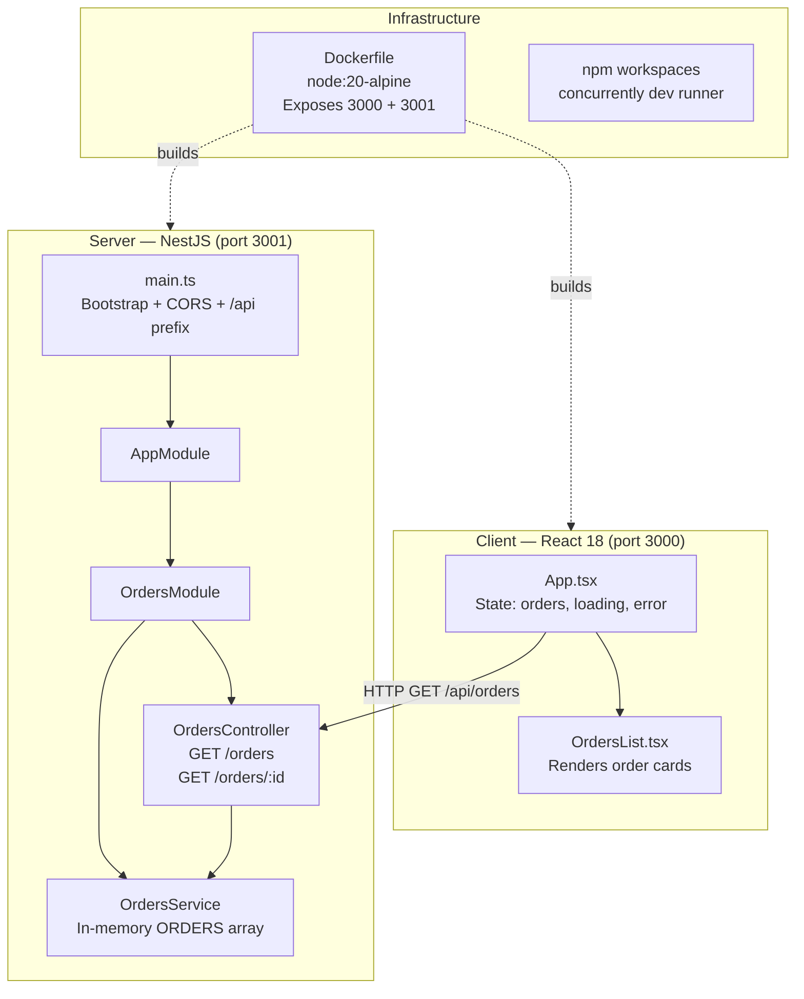
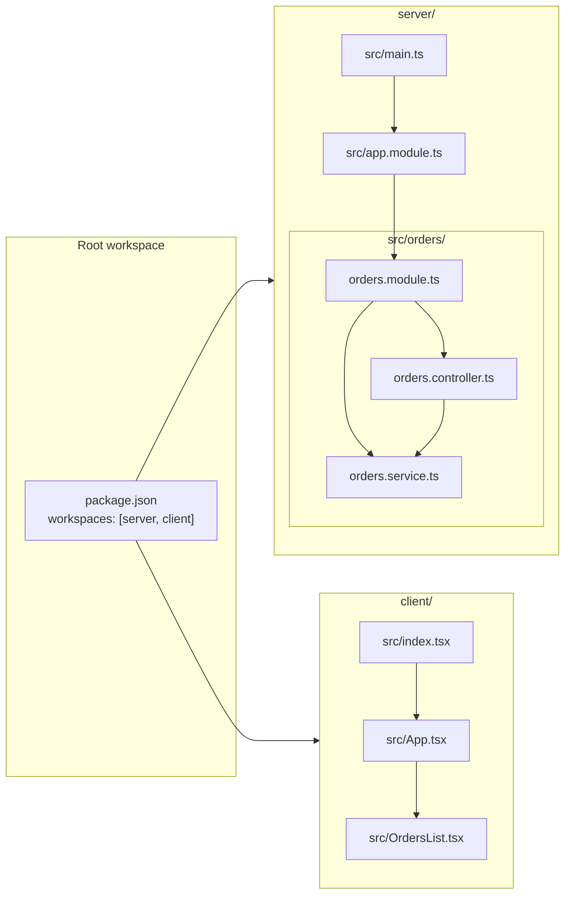
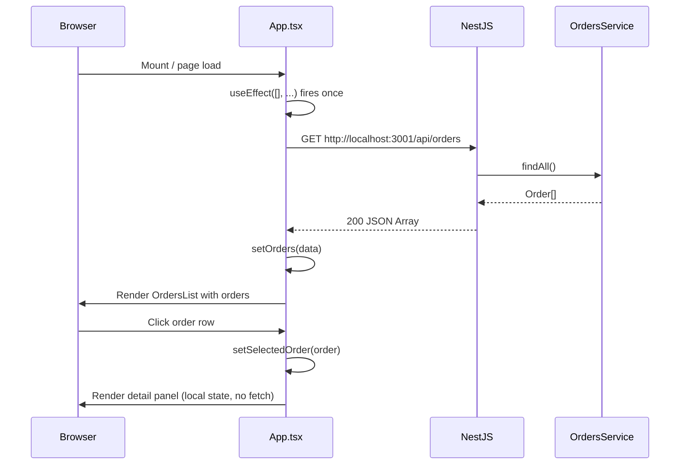
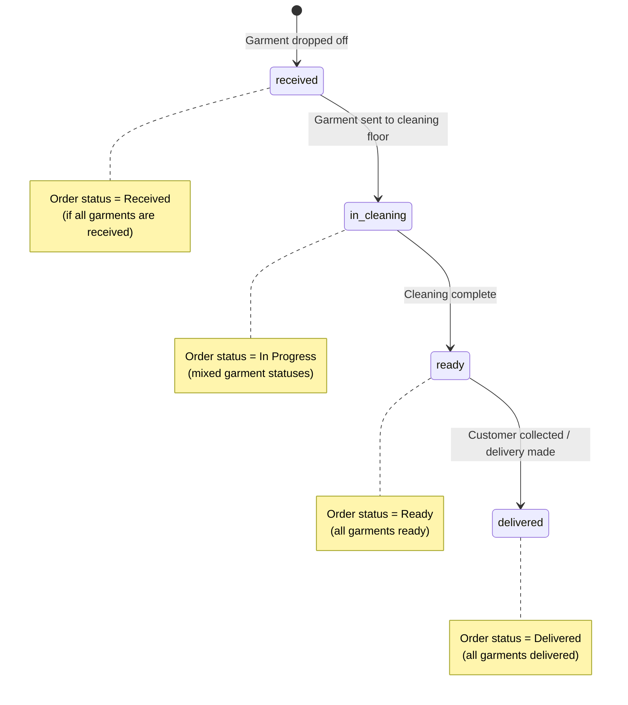
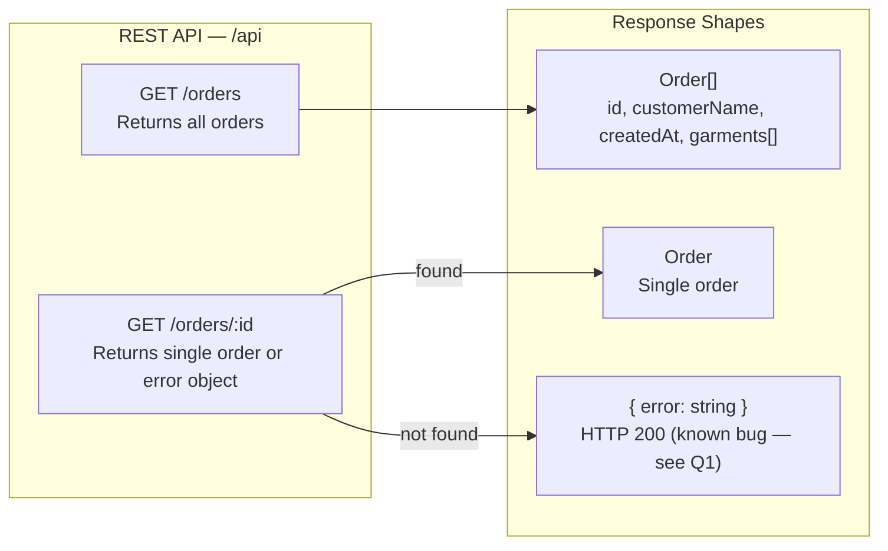
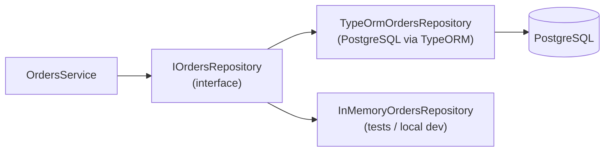
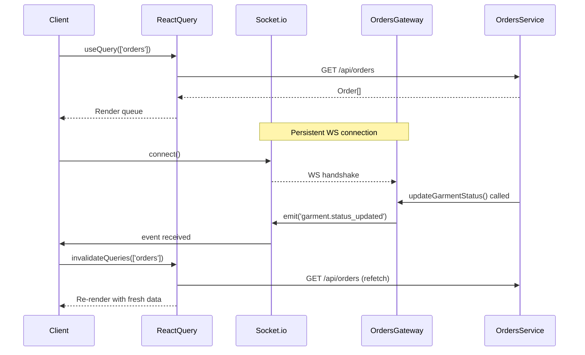
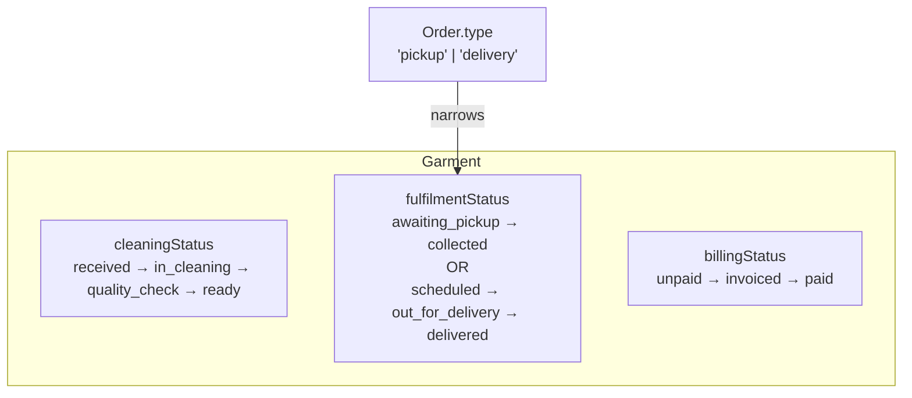
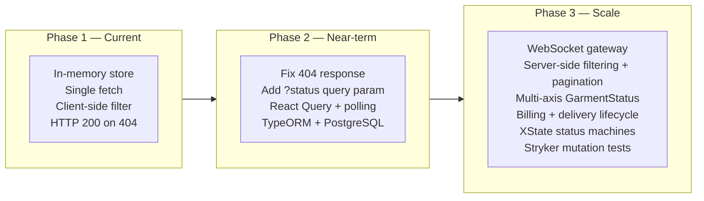

# QDC Ops — Order Lifecycle Orchestration & Monitoring Platform

> **A full-stack operations workspace for dry-cleaning stores** — real-time order tracking, garment-level status management, and a compact operational queue built on NestJS + React.

---

## Table of Contents

- [Overview](#overview)
- [Live Screenshots](#live-screenshots)
- [Architecture](#architecture)
  - [System Architecture](#system-architecture)
  - [Module Structure](#module-structure)
  - [Data Flow](#data-flow)
  - [Garment Status Lifecycle](#garment-status-lifecycle)
  - [API Contract](#api-contract)
- [Tech Stack](#tech-stack)
- [Project Structure](#project-structure)
- [Getting Started](#getting-started)
  - [Prerequisites](#prerequisites)
  - [Local Development](#local-development)
  - [Docker](#docker)
- [Core Domain Model](#core-domain-model)
  - [Order](#order)
  - [Garment](#garment)
  - [Status Derivation Logic](#status-derivation-logic)
- [API Reference](#api-reference)
- [Frontend Design](#frontend-design)
  - [Layout](#layout)
  - [Filter Tabs](#filter-tabs)
  - [Order Detail Panel](#order-detail-panel)
- [Engineering Decisions & Trade-offs](#engineering-decisions--trade-offs)
  - [Q1 — HTTP 404 vs 200 on Missing Orders](#q1--http-404-vs-200-on-missing-orders)
  - [Q2 — In-Memory Store vs Production Data Layer](#q2--in-memory-store-vs-production-data-layer)
  - [Q3 — Single Fetch vs Real-Time Updates](#q3--single-fetch-vs-real-time-updates)
  - [Q4 — Evolving GarmentStatus as Domain Grows](#q4--evolving-garmentstatus-as-domain-grows)
  - [Q5 — AI-Generated Code Risks & Validation](#q5--ai-generated-code-risks--validation)
  - [Q6 — Client-Side vs Server-Side Filtering](#q6--client-side-vs-server-side-filtering)
- [Production Roadmap](#production-roadmap)
- [Author](#author)

---

## Overview

QDC Ops is a POS-style operations workspace for a dry-cleaning store. It tracks orders from drop-off through cleaning to customer pickup, with garment-level granularity. The platform is designed to be the **shared ground truth** between front-desk staff and the cleaning floor.

**Key capabilities:**

| Capability | Details |
|---|---|
| Order queue | Compact table view with ORDER ID, customer, garment count, date, and status |
| Status filtering | Tabs for All / Received / In Cleaning / Ready / Delivered |
| Garment-level tracking | Each garment has its own status; order status is derived |
| Order detail panel | Side panel with per-garment status breakdown and status badges |
| Quick actions | Create Order and Add Customer shortcuts in the sidebar |

---

## Live Screenshots

### All Orders — Default View

The main workspace shows the full order queue. Selecting an order populates the detail panel on the right with per-garment status and a status breakdown badge row.


---

### Received Filter Active

Clicking the `Received` tab filters the queue to orders where at least one garment is in `received` status. The count badge on the tab updates dynamically.


---

### Ready Filter Active

The `Ready` tab shows orders with all garments in `ready` status — indicating the order is ready for customer pickup. The sidebar's "Ready For Pickup" workspace item also reflects this count.


---

## Architecture

### System Architecture



---

### Module Structure



---

### Data Flow



---

### Garment Status Lifecycle

Each garment moves through a linear status pipeline. The parent order's displayed status is **derived** from the aggregate of its garment statuses.



**Order status derivation rule (current implementation):**

| Garment statuses | Derived order status |
|---|---|
| All `received` | `Received` |
| Any `in_cleaning`, others `received` | `In Progress` |
| All `ready` | `Ready` |
| All `delivered` | `Delivered` |
| Mixed (e.g. `received` + `ready`) | `In Progress` |

---

### API Contract



---

## Tech Stack

| Layer | Technology | Version |
|---|---|---|
| Server runtime | Node.js | 20 (LTS) |
| Server framework | NestJS | ^10 |
| Server language | TypeScript | ^5.4 |
| HTTP library | Express (via NestJS) | ^4.19 |
| Client framework | React | ^18.2 |
| Client language | TypeScript | ^5.4 |
| Client toolchain | Create React App / react-scripts | 5.0.1 |
| Monorepo management | npm workspaces | — |
| Dev concurrency | concurrently | ^8.2.2 |
| Container | Docker (node:20-alpine) | — |
| Server hot reload | ts-node-dev | ^2.0 |

---

## Project Structure

```
qdc-mini-assignment/
├── package.json              # Root workspace — dev scripts, concurrently
├── Dockerfile                # Multi-stage build, exposes 3000 + 3001
│
├── server/
│   ├── package.json          # NestJS deps — @nestjs/common, rxjs, reflect-metadata
│   ├── tsconfig.json
│   └── src/
│       ├── main.ts           # NestFactory bootstrap, CORS, /api global prefix, port 3001
│       ├── app.module.ts     # Root module — imports OrdersModule
│       └── orders/
│           ├── orders.module.ts       # NestJS module declaration
│           ├── orders.controller.ts   # GET /orders, GET /orders/:id
│           └── orders.service.ts      # In-memory ORDERS store, business logic
│
└── client/
    ├── package.json          # React 18 + react-scripts + TypeScript
    ├── tsconfig.json
    └── src/
        ├── index.tsx         # React DOM mount
        ├── App.tsx           # Root component — fetch, state, layout
        └── OrdersList.tsx    # Order card renderer with status labels
```

---

## Getting Started

### Prerequisites

- **Node.js** ≥ 20
- **npm** ≥ 9 (for workspace support)
- **Docker** (optional, for containerised run)

### Local Development

```bash
# 1. Clone the repository
git clone <repo-url>
cd qdc-mini-assignment

# 2. Install all workspace dependencies
npm install --workspaces

# 3. Start both server and client concurrently
npm run dev
```

| Service | URL |
|---|---|
| React client | http://localhost:3000 |
| NestJS API | http://localhost:3001/api |

**Run services individually:**

```bash
# Server only (hot-reload via ts-node-dev)
npm run server

# Client only (CRA dev server)
npm run client
```

### Docker

```bash
# Build the image
docker build -t qdc-ops .

# Run (maps container ports to host)
docker run -p 3000:3000 -p 3001:3001 qdc-ops
```

The Dockerfile:
1. Uses `node:20-alpine` as the base
2. Installs workspace dependencies
3. Builds both `server` (tsc) and `client` (react-scripts build)
4. Exposes ports 3000 and 3001
5. Runs `npm run dev` as the default command

---

## Core Domain Model

### Order

```typescript
interface Order {
  id: string;          // e.g. "ORD-1001"
  customerName: string;
  createdAt: string;   // ISO 8601
  garments: Garment[];
}
```

### Garment

```typescript
type GarmentStatus = 'received' | 'in_cleaning' | 'ready' | 'delivered';

interface Garment {
  id: string;           // e.g. "G-1"
  description: string;  // e.g. "Blue Shirt"
  status: GarmentStatus;
}
```

### Status Derivation Logic

The `OrdersList.tsx` component derives a display label per garment status:

```typescript
const statusLabel: Record<string, string> = {
  received:    'Received',
  in_cleaning: 'In Cleaning',
  ready:       'Ready for Pickup',
  delivered:   'Delivered',
};
```

Order-level status (shown in the queue table) is computed from the garment array — if any garment is `in_cleaning`, the order is `In Progress`; if all are `ready`, the order is `Ready`.

**Seed data (in-memory mock):**

| Order | Customer | Garment | Garment Status |
|---|---|---|---|
| ORD-1001 | Alice Johnson | Blue Shirt | `received` |
| ORD-1001 | Alice Johnson | Black Trousers | `in_cleaning` |
| ORD-1002 | Bob Singh | Wedding Gown | `ready` |

---

## API Reference

### `GET /api/orders`

Returns all orders with their full garment arrays.

**Response `200 OK`:**
```json
[
  {
    "id": "ORD-1001",
    "customerName": "Alice Johnson",
    "createdAt": "2026-05-30T00:00:00.000Z",
    "garments": [
      { "id": "G-1", "description": "Blue Shirt",     "status": "received"    },
      { "id": "G-2", "description": "Black Trousers", "status": "in_cleaning" }
    ]
  },
  {
    "id": "ORD-1002",
    "customerName": "Bob Singh",
    "createdAt": "2026-05-30T00:00:00.000Z",
    "garments": [
      { "id": "G-3", "description": "Wedding Gown", "status": "ready" }
    ]
  }
]
```

---

### `GET /api/orders/:id`

Returns a single order by ID.

**Response `200 OK` (found):**
```json
{
  "id": "ORD-1001",
  "customerName": "Alice Johnson",
  "createdAt": "2026-05-30T00:00:00.000Z",
  "garments": [ ... ]
}
```

**Response `200 OK` (not found — known issue, should be 404):**
```json
{ "error": "Order with id ORD-9999 not found" }
```

> ⚠️ See [Q1 — HTTP 404 vs 200](#q1--http-404-vs-200-on-missing-orders) for the full analysis and fix.

---

## Frontend Design

### Layout

The UI is a three-panel layout:

```
┌─────────────────┬──────────────────────────────────┬──────────────────┐
│   SIDEBAR       │   MAIN QUEUE                     │   DETAIL PANEL   │
│                 │                                  │                  │
│  QDC Ops        │  [Search bar]                    │  DETAILS         │
│  Operations     │                                  │  Selected Order  │
│  Workspace      │  [All][Received][In Cleaning]... │                  │
│                 │                                  │  Customer        │
│  Inbox      2   │  ORDER ID  CUSTOMER  GARMENTS    │  Order Date      │
│  My Orders  2   │  ORD-1001  Alice     2           │                  │
│                 │  ORD-1002  Bob       1           │  GARMENTS        │
│  WORKSPACE      │                                  │  Blue Shirt      │
│  Ready       1  │                                  │  Black Trousers  │
│  In Cleaning 1  │                                  │                  │
│  Delivered   0  │                                  │  STATUS BREAKDOWN│
│                 │                                  │  received 1      │
│  QUICK ACTIONS  │                                  │  in cleaning 1   │
│  Create Order   │                                  │                  │
│  Add Customer   │                                  │  Status: In Prog │
└─────────────────┴──────────────────────────────────┴──────────────────┘
```

### Filter Tabs

| Tab | Meaning |
|---|---|
| `All` | Show all orders regardless of status |
| `Received` | Orders with at least one garment in `received` |
| `In Cleaning` | Orders with at least one garment in `in_cleaning` |
| `Ready` | Orders where all garments are `ready` |
| `Delivered` | Orders where all garments are `delivered` |

### Order Detail Panel

Clicking any row in the queue populates the right panel with:
- Customer name
- Order date
- Garment list with individual status badges (`received` green, `in_cleaning` amber, `ready` blue, `delivered` gray)
- Status breakdown pills (e.g. `received 1`, `in cleaning 1`)
- Derived order-level status

---

## Engineering Decisions & Trade-offs

### Q1 — HTTP 404 vs 200 on Missing Orders

**Current behaviour:** `GET /api/orders/MISSING` returns HTTP `200` with body `{ error: "Order with id MISSING not found" }`.

**Problems this causes:**

1. **Clients cannot use HTTP semantics** — `fetch`, Axios, and React Query all branch on status code, not body inspection. Every consumer must duplicate a custom body-inspection check.
2. **Monitoring is blind** — APM tools (Datadog, Sentry, New Relic) classify all 2xx as success. A store making 500 requests for missing orders per hour shows zero errors in every dashboard.
3. **CDN cache poisoning** — A CDN configured to cache 2xx responses will cache the error body and serve it indefinitely, even after the order is created.
4. **Broken OpenAPI types** — The union `Order | { error: string }` cannot be expressed on a single HTTP 200 response. Generated SDKs are wrong or require manual overrides.

**Fix:**

```typescript
// orders.service.ts
import { NotFoundException } from '@nestjs/common';

findOne(id: string): Order {
  const order = ORDERS.find((o) => o.id === id);
  if (!order) {
    throw new NotFoundException(`Order ${id} not found`);
    // NestJS global filter → HTTP 404 { statusCode, message, error }
  }
  return order;
}
```

```typescript
// orders.controller.ts — simplified
@Get(':id')
getOrder(@Param('id') id: string): Order {
  return this.ordersService.findOne(id); // throws 404 automatically
}
```

**Test:**
```typescript
it('GET /api/orders/MISSING returns 404', async () => {
  const res = await request(app.getHttpServer()).get('/api/orders/ORD-9999');
  expect(res.status).toBe(404);
  expect(res.body.message).toContain('ORD-9999');
});
```

---

### Q2 — In-Memory Store vs Production Data Layer

**Current:** `ORDERS` is a module-level constant array. Every restart resets all data. Two instances of the server hold two independent arrays — horizontal scaling is broken by design.

**Production data layer:**



**Key changes:**

| Concern | Current | Production |
|---|---|---|
| Persistence | None (restart = data loss) | PostgreSQL / TypeORM |
| Setup | Zero | Docker, migrations, connection pool |
| Durability | None | Full ACID |
| Horizontal scale | Broken | Works with connection pooling |
| Test speed | Instant | TestContainers or InMemoryRepository |

**Repository interface:**
```typescript
interface IOrdersRepository {
  findAll(): Promise<Order[]>;
  findOneOrFail(id: string): Promise<Order>; // throws NotFoundException
  save(order: Order): Promise<Order>;
  updateGarmentStatus(orderId: string, garmentId: string, status: GarmentStatus): Promise<Order>;
}
```

---

### Q3 — Single Fetch vs Real-Time Updates

**Current:** `useEffect([], ...)` runs once on mount. The UI is a static snapshot. Staff at the front desk will show stale data until the browser is manually refreshed.

**Why this matters:** A dry-cleaning store processes dozens of orders per hour. Counter staff need to know the moment a garment moves to `ready` — a stale dashboard is a direct service failure.

**Alternatives evaluated:**

| Approach | Latency | Server load | Complexity | Offline |
|---|---|---|---|---|
| Single fetch (current) | Infinite | Minimal | None | After load |
| Polling 10s | ≤10s | O(clients/10s) | Low | After load |
| SSE | ~0ms | Low | Medium | No |
| **WebSockets (recommended)** | **~0ms** | **Low** | **Medium** | **No** |
| React Query alone | Configurable | Low | Low | Partial |

**Recommended architecture (WebSockets + React Query):**



---

### Q4 — Evolving GarmentStatus as Domain Grows

**Current:** `type GarmentStatus = 'received' | 'in_cleaning' | 'ready' | 'delivered'`

This flat union conflates the cleaning lifecycle with the fulfilment lifecycle. As billing, delivery, and prepaid packages are added, the union becomes a combinatorial explosion.

**Production type design — three independent axes:**

```typescript
// Cleaning lifecycle — always present
type CleaningStatus = 'received' | 'in_cleaning' | 'quality_check' | 'ready';

// Fulfilment — depends on order type
type PickupStatus   = 'awaiting_pickup' | 'collected';
type DeliveryStatus = 'scheduled' | 'out_for_delivery' | 'delivered' | 'delivery_failed';

// Billing — orthogonal to cleaning
type BillingStatus = 'unpaid' | 'invoiced' | 'paid' | 'refunded';

// Discriminated union on Order type prevents invalid state
type Order =
  | { type: 'pickup';   garments: Array<Garment & { fulfilmentStatus: PickupStatus }> }
  | { type: 'delivery'; garments: Array<Garment & { fulfilmentStatus: DeliveryStatus }> };
```



The TypeScript discriminated union prevents `out_for_delivery` ever appearing on a pickup order at compile time — no runtime validation needed.

---

### Q5 — AI-Generated Code Risks & Validation

When `OrdersService` methods are generated by an AI tool, five specific failure patterns are likely:

| Risk | Example | Detection |
|---|---|---|
| `\|\|` instead of `??` in accumulators | `summary[g.status] = (summary[g.status] \|\| 0) + 1` treats `0` as falsy | Unit tests with pre-initialised objects |
| Route shadowing | `@Get(':id')` declared before `@Get('summary')` — `summary` is unreachable | Integration test: `GET /api/orders/summary` must not return an error object |
| Hallucinated APIs | Decorators or methods that don't exist in the installed version | `tsc --noEmit --strict` |
| CORS `origin: '*'` | `NestFactory.create(AppModule, { cors: true })` is the current config | Security audit checklist |
| SQL injection | String interpolation into raw query strings in TypeORM migration | Code review + parameterised query linting |

**Validation process before shipping:**

```
1. Write tests from the spec BEFORE reading the generated code
2. tsc --noEmit --strict (catches hallucinated symbols)
3. Integration test the HTTP layer with supertest
4. Code review checklist (|| vs ??, route order, origin, interpolation)
5. Mutation testing with Stryker to verify test suite actually guards the logic
```

---

### Q6 — Client-Side vs Server-Side Filtering

**Current:** The full order array is fetched once; the status filter operates on it in the browser with no additional network requests.

**When client-side filtering is correct:** Now. Two orders, three garments. Instant, works offline, zero server load per filter interaction.

**When server-side filtering becomes necessary:**

| Signal | Why server-side is required |
|---|---|
| Pagination | Client cannot filter data it doesn't have |
| Large dataset | Sending 6,000 garments to filter 50 wastes bandwidth |
| Access control | A client-side filter is a UI courtesy, not a security control |
| Cross-store admin | Aggregating across locations requires a DB `WHERE` clause |
| Full-text search | Requires a database index |

**Recommended migration path:**

```typescript
// Step 1: Add optional ?status query parameter NOW (non-breaking)
// orders.controller.ts
@Get()
getOrders(@Query('status') status?: GarmentStatus): Order[] {
  return this.ordersService.findAll(status);
}

// orders.service.ts
findAll(status?: GarmentStatus): Order[] {
  if (!status) return ORDERS;
  return ORDERS
    .map(o => ({ ...o, garments: o.garments.filter(g => g.status === status) }))
    .filter(o => o.garments.length > 0);
}
```

```typescript
// Step 2: When pagination lands — client sends ?status= automatically
// No API change required; only the client fetch URL changes
const url = selectedStatus === 'all'
  ? '/api/orders'
  : `/api/orders?status=${selectedStatus}`;
```

This is the correct application of YAGNI: don't build server-side filtering before you need it, but design the API so adding it later is a non-breaking change.

---

## Production Roadmap



---

## Author

**Sudharsan Selvaraj** — AI Engineer Intern  
Agentic AI Engineering · LLM Systems · Backend Infrastructure  

[GitHub](https://github.com/Sudharsanselvaraj) · [LinkedIn](https://linkedin.com/in/sudharsan-s-528a8a2a0)

---

*This documentation was authored as part of the QDC Mini Assignment, covering the full platform architecture, engineering trade-offs, and a production evolution roadmap.*
